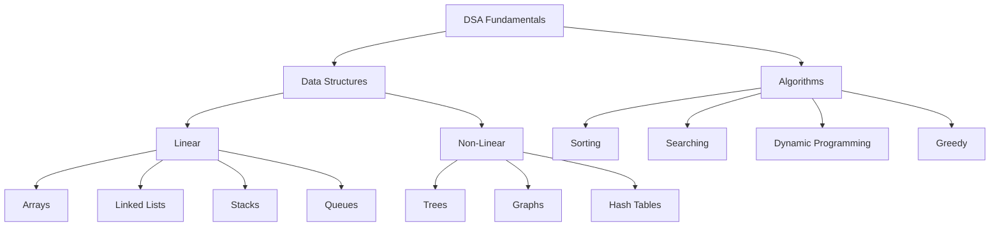

# Data Structures & Algorithms (DSA)

<div align="center">
  
</div>

A comprehensive collection of Data Structures and Algorithms implementations with detailed explanations and examples.

## 📊 Visual Overview



## 📚 Contents

### 1. Basic Data Structures
- **Arrays & Strings**
  ```
  ┌───┬───┬───┬───┬───┐
  │ 1 │ 2 │ 3 │ 4 │ 5 │
  └───┴───┴───┴───┴───┘
  ```
  - Array manipulation
  - String algorithms
  - Dynamic arrays
  - Matrix operations

- **Linked Lists**
  ```
  ┌────┐    ┌────┐    ┌────┐
  │ 1  │───>│ 2  │───>│ 3  │───> null
  └────┘    └────┘    └────┘
  ```
  - Singly linked lists
  - Doubly linked lists
  - Circular linked lists
  - Operations & algorithms

- **Stacks & Queues**
  ```
  Stack:         Queue:
  │ 3 │         ┌─►┌─►┌─►
  │ 2 │         1  2  3
  │ 1 │         
  └───┘
  ```
  - Stack implementations
  - Queue variations
  - Priority queues
  - Deques

### 2. Trees
```
     Binary Tree:          BST:
        1                  4
      /   \              /   \
     2     3            2     6
    / \   /            / \   / \
   4   5 6            1   3 5   7
```
- **Binary Trees**
  - Binary Search Trees (BST)
  - AVL Trees
  - Red-Black Trees
  - Tree traversals

- **Advanced Trees**
  ```
  Trie:
       root
     /   |   \
    a    b    c
   /    /
  n    e
  |    |
  t    d
  ```
  - B-Trees
  - Segment Trees
  - Trie
  - Heap

### 3. Hash-Based Structures
```
Hash Table:
┌────┐
│ 0  │──► (key1,val1) ──► (key2,val2)
├────┤
│ 1  │──► (key3,val3)
├────┤
│ 2  │──► (key4,val4)
└────┘
```
- Hash Tables
- Hash Maps
- Collision resolution
- Hash functions

### 4. Graphs
```
Undirected Graph:    Directed Graph:
1 ─── 2             1 ───► 2
│     │             │     ▲
│     │             ▼     │
4 ─── 3             4 ───► 3
```
- **Representations**
  - Adjacency Matrix
  - Adjacency List
  - Edge List

- **Algorithms**
  ```
  BFS:                DFS:
  Layer by Layer      Deep First
  →→→→→              ↓↓↓↓↓
  ```
  - DFS & BFS
  - Dijkstra's Algorithm
  - Bellman-Ford
  - Floyd-Warshall
  - Minimum Spanning Trees
    - Prim's
    - Kruskal's

### 5. Algorithm Techniques
- **Sorting**
  ```
  Unsorted: [5,2,8,1,9]
  Sorted:   [1,2,5,8,9]
  ```
  - Bubble Sort
  - Selection Sort
  - Insertion Sort
  - Merge Sort
  - Quick Sort
  - Heap Sort

- **Searching**
  ```
  Binary Search:
  [1,2,3,4,5,6,7,8,9]
       ↑
     middle
  ```
  - Linear Search
  - Binary Search
  - Interpolation Search

- **Dynamic Programming**
  ```
  Fibonacci:
  [1,1,2,3,5,8,13,21]
  ```
  - Memoization
  - Tabulation
  - Common problems

- **Greedy Algorithms**
  - Activity Selection
  - Huffman Coding
  - Fractional Knapsack

### 6. Advanced Topics
```
Bit Manipulation:
AND: 1 & 1 = 1
OR:  1 | 0 = 1
XOR: 1 ^ 1 = 0
```
- Bit Manipulation
- Mathematical Algorithms
- Backtracking
- Divide & Conquer

## 🚀 Getting Started

Each topic contains:
- Implementation code
- Time & space complexity analysis
- Example usage
- Practice problems
- Common interview questions

## 📖 How to Use

1. Choose a topic from the contents
2. Read the theory and explanation
3. Study the implementation
4. Try solving practice problems
5. Review solutions and optimize

## 🤝 Contributing

Contributions are welcome! Please feel free to submit a Pull Request.

## 📝 Notes

- All implementations include detailed comments
- Time and space complexity are mentioned for each algorithm
- Examples are provided to demonstrate real-world applications
- Code is optimized for readability and performance

## 📈 Complexity Chart

```
┌───────────┬────────────┬────────────┐
│ Algorithm │ Time       │ Space      │
├───────────┼────────────┼────────────┤
│ Quick Sort│ O(n log n) │ O(log n)   │
│ BFS       │ O(V + E)   │ O(V)       │
│ DFS       │ O(V + E)   │ O(V)       │
│ Binary    │ O(log n)   │ O(1)       │
└───────────┴────────────┴────────────┘
```

## 📌 Resources

- [Big-O Cheat Sheet](https://www.bigocheatsheet.com/)
- [Visualgo - Algorithm Visualization](https://visualgo.net/)
- [GeeksforGeeks](https://www.geeksforgeeks.org/)
- [LeetCode](https://leetcode.com/)

## ⭐ Star this Repository

If you find this helpful, please star this repository to help others discover it!

## 📜 License

This project is licensed under the MIT License - see the [LICENSE](LICENSE) file for details.